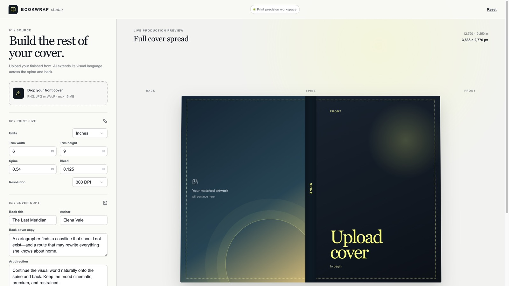
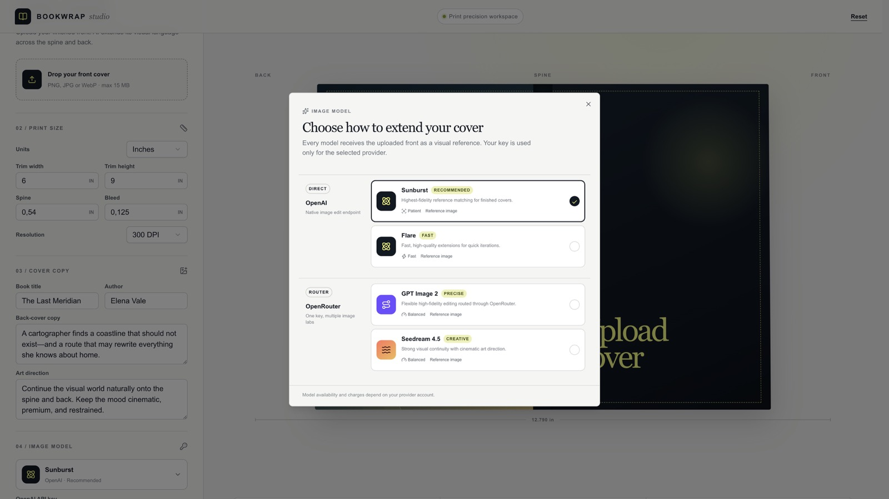

<p align="center">
  
</p>

<h1 align="center">Bookwrap Studio</h1>

<p align="center">
  Turn a finished front cover into a cohesive, print-ready full wrap—<br />
  back, spine, and front—at the exact dimensions you specify.
</p>

<p align="center">
  <a href="https://bookwrap-studio.workspace-392829.chatgpt.site/"><strong>Live app</strong></a>
  &nbsp;·&nbsp;
  <a href="#run-locally">Run locally</a>
  &nbsp;·&nbsp;
  <a href="#how-generation-works">How it works</a>
</p>

<p align="center">
  
  
  
  
</p>

<p align="center">
  
</p>

<p align="center">
  
</p>

## What it does

Upload a finished front cover. Bookwrap Studio extends that visual language across the spine and back with an image model, then composites the result onto a dimensionally exact print canvas in the browser.

| Production input | Supported options |
| --- | --- |
| Front artwork | PNG, JPG, or WebP up to 15 MB |
| Cover geometry | Trim width, trim height, spine width, and bleed |
| Units | Inches or millimetres |
| Resolution | 150, 300, or 600 DPI |
| Export | Separate front, spine, and back PNGs plus the complete wrap |

The live preview updates finished spread dimensions and pixel count before generation, so layout mistakes show up early.

## Highlights

- **Reference-aware generation.** The uploaded front cover is the visual reference for the matching back and spine.
- **OpenAI and OpenRouter BYOK.** Pick a provider and use your own API key for that job only.
- **Purpose-built model picker.** Provider icons, speed hints, and selection state make the trade-offs obvious.
- **Streamed job status.** Queued → analysis → generation → compositing → done, while the image request runs.
- **Print math, not guesswork.** The browser builds the pixel canvas from trim, spine, bleed, and DPI.
- **Production exports.** Download individual panels or the full wrap as lossless PNGs.

> [!IMPORTANT]
> Always compare the final spread with your printer's current cover template, barcode area, safe zones, colour profile, and bleed requirements before sending it to press.

## Models and providers

| Provider | Model | Best for |
| --- | --- | --- |
| OpenAI | Sunburst | Highest-fidelity reference matching |
| OpenAI | Flare | Faster high-quality iterations |
| OpenRouter | GPT Image 2 | Precise editing through a routed provider |
| OpenRouter | Seedream 4.5 | Creative continuity and cinematic art direction |

Availability and charges follow the selected provider account.

## BYOK privacy model

API keys stay ephemeral:

1. The key lives only in the current browser session.
2. It is sent over HTTPS to the generation route for the active request.
3. The route forwards it only to the selected OpenAI or OpenRouter endpoint.
4. It is not written to local storage, a database, logs, or this repository.

For a public deployment, add rate limits, abuse controls, request-size enforcement, and a provider allowlist before inviting untrusted traffic.

## How generation works

```text
Front cover + dimensions + model + temporary key
                         │
                         ▼
              POST /api/generate
                         │
              streamed NDJSON status
                         │
            OpenAI or OpenRouter image edit
                         │
                         ▼
          matched back/spine artwork
                         │
                         ▼
       browser canvas → exact-size print wrap
                         │
                         ▼
          front · spine · back · full-wrap PNG
```

Work stays request-scoped so the key never sits in a durable queue. A multi-user production version can move generation into a worker once it has a short-lived credential strategy.

## Print dimensions

For a full wrap with bleed on all outer edges:

```text
spread width  = (2 × trim width) + spine width + (2 × bleed)
spread height = trim height + (2 × bleed)
pixels        = physical dimension × DPI
```

Millimetre inputs convert with `mm ÷ 25.4` before the pixel calculation.

## Run locally

### Prerequisites

- Node.js 22.13 or newer
- npm
- An OpenAI or OpenRouter API key, entered in the app when you generate

### Setup

```bash
git clone https://github.com/alexander-gekov/bookwrap-studio.git
cd bookwrap-studio
npm ci
npm run dev
```

Open [http://localhost:5173](http://localhost:5173). No environment-file API key is required.

### Commands

```bash
npm run dev      # local Vinext development server
npm run lint     # ESLint
npm run build    # production Cloudflare Worker build
npm run start    # preview the built Worker locally
```

## Project structure

```text
app/
├── api/generate/route.ts   # provider calls + streamed job events
├── globals.css             # studio UI
└── page.tsx                # editor, print math, canvas exports
components/
└── model-picker.tsx        # provider-aware image model picker
public/
└── favicon.svg             # mark
docs/assets/                # README screenshots
```

## Stack

Next.js 16 · React 19 · Vinext · Vite · Cloudflare Workers · TypeScript · Tailwind CSS · OpenAI Images API · OpenRouter Images API

## Deployment

The production app is hosted on OpenAI Sites and currently requires ChatGPT sign-in. Provider keys are still supplied per job, not stored as server secrets.

---

<p align="center">
  Designed for authors and publishers who need the artwork to feel continuous—and the measurements to be exact.
</p>
